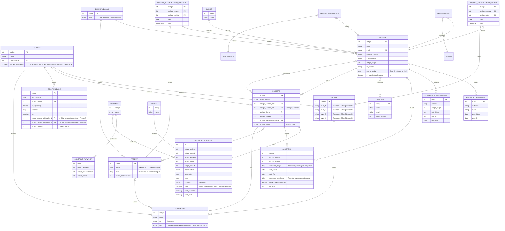

```mermaid

erDiagram    
        
    CLIENTE {
        int codigo PK        
        string nome
        int codigo_setor FK   
        boolean eh_relacionamento "Contatos->Usar na tela de 'Empresa com relacionamento' IA"             
    }

    SETOR {
        int codigo PK
        string nivel_1 "Taxonomia CT.xls[Setores]N1"
        string nivel_2 "Taxonomia CT.xls[Setores]N2"
        string nivel_3 "Taxonomia CT.xls[Setores]N3"
        string nivel_4 "Taxonomia CT.xls[Setores]N4"
    }

    PROJETO {
        int codigo PK
        string nome_projeto 
        int codigo_pessoa_lider FK
        int codigo_pessoa_md FK "Managing Director"
        int codigo_cliente FK 
        int codigo_produto FK 
        int codigo_checklist_alavanca FK
        string codigo_prime "External code"
    }

    OPORTUNIDADE {
        int codigo PK
        string oportunidade 
        int codigo_cliente FK
        dominio stage(status)
        string currency
        monetary fee
        int codigo_pessoa_originador_1 FK "<<Dúvida>> Criar automaticamente em Pessoa?"
        int codigo_pessoa_originador_2 FK "<<Dúvida>> Criar automaticamente em Pessoa?"
        int codigo_produto "Offering Name"
    }

    PESSOA {
        int codigo PK
        string nome
        string email UK
        string historico_pessoal
        string autoavaliacao  
        int codigo_cargo 
        string url_linkedin 
        date data_entrada "Data de entrada na A&M"  
        boolean eh_habilitado_alocacao "<<Dúvida>>"
    }

    CARGO {
        int codigo
        string nome
    }

    ESPECIALIZACAO {
        int codigo PK
        string nome "Taxonomia CT.xls[Produtos]N1"
    }

    ALOCACAO {        
        int codigo
        int codigo_pessoa
        int codigo_projeto
        string descricao_projeto "Texto livre para Projeto Temporário"        
        date data_inicio        
        date data_fim
        string descricao_conclusao "Papel/conquistas/contribuicoes"
        percent porcentagem_alocacao 
        flag eh_ativa
    }

    PRODUTO {
        int codigo PK
        string produto "Taxonomia CT.xls[Produtos]N3"
        string pilar "Taxonomia CT.xls[Produtos]N2"
        int codigo_especializacao        
    }

    DOCUMENTO {
        int codigo
        string nome
        string url "Sharepoint"
        enum tipo "CASE|PROPOSTA|POV|TESE|DOCUMENTO_PROJETO"
    }


    ALAVANCA {
        int codigo
        string nome 
    }

    CONTROLE_ALAVANCA {
        int codigo
        int codigo_alavanca
        int codigo_especializacao
        int codigo_frente        
    }

    CHECKLIST_ALAVANCA {
        int int
        int codigo_projeto
        int codigo_impacto 
        int codigo_alavanca
        int codigo_frente
        int codigo_impacto
        enum implementado
        enum recorrente
        enum base
        string iniciativa "Descrição" 
        currency valor "(valor_baseline-valor_final) - positivo/negativo"      
        currency valor_baseline
        currency valor_final
    }

    IMPACTO {
        int codigo
        string nome
    }    

    CONTATO {
        int codigo PK
        string nome
        string email
        int codigo_cliente
    }

    PESSOA_AUTOAVALIACAO_SETOR {
        int codigo PK
        int codigo_pessoa FK
        int codigo_setor FK
        date data
        percentual nota
    }

    PESSOA_AUTOAVALIACAO_PRODUTO {
        int codigo PK
        int codigo_pessoa FK
        int codigo_produto FK
        date data
        percentual nota
    }

    FORMACAO_ACADEMICA {
        int codigo PK
        string instituicao
        string curso
        date data_inicio
        date data_fim
    }

    EXPERIENCIA_PROFISSIONAL {
        int codigo PK
        string empresa
        int codigo_cargo
        date data_inicio
        date data_fim
        string descricao
    }

    PESSOA ||--o{ FORMACAO_ACADEMICA: cursa
    PESSOA ||--o{ EXPERIENCIA_PROFISSIONAL: trabalha
    PESSOA_IDIOMA }|--|| PESSOA: fala
    PESSOA_IDIOMA }|--|| IDIOMA: eh_falado
    PESSOA_CERTIFICACAO }|--|| PESSOA: possui
    PESSOA_CERTIFICACAO }|--|| CERTIFICACAO: possui
    PESSOA_AUTOAVALIACAO_SETOR }|--|| PESSOA: possui
    PESSOA_AUTOAVALIACAO_SETOR }|--|| SETOR: possui
    PESSOA_AUTOAVALIACAO_PRODUTO }|--|| PESSOA: possui
    PESSOA_AUTOAVALIACAO_PRODUTO }|--|| PRODUTO: possui
    ALAVANCA ||--o{ CONTROLE_ALAVANCA: controlada
    ALAVANCA ||--o{ CHECKLIST_ALAVANCA: verificada
    IMPACTO ||--o{ CHECKLIST_ALAVANCA: impacta
    PROJETO ||--o{ CHECKLIST_ALAVANCA: tem
    CLIENTE }o--|{ SETOR: pertence
    CLIENTE ||--o{ PROJETO: demanda
    CLIENTE ||--o{ OPORTUNIDADE : existe
    CARGO ||--o{ PESSOA : atribuido
    ESPECIALIZACAO ||--o{ PESSOA : possui
    PESSOA ||--o{ ALOCACAO : alocada
    PESSOA }o--o{ CONTATO : relaciona
    PROJETO ||--o{ ALOCACAO : alocada
    PROJETO }o--|{ PRODUTO : alocada
    ESPECIALIZACAO ||--o{ PRODUTO : possui
    PESSOA ||--o{ PROJETO : lidera
    PESSOA ||--o{ PROJETO : gerenciado
    PROJETO ||--o{ DOCUMENTO: tem
    SETOR ||--o{ DOCUMENTO: possui
    CLIENTE ||--o{ DOCUMENTO: artefatos
    PRODUTO }|--o{ DOCUMENTO: possui

```