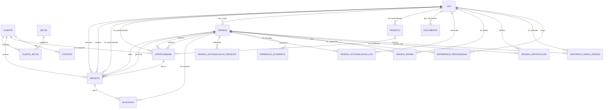

```mermaid

erDiagram    
    
    CLIENTE ||--o{ CLENTE_SETOR: atribuido
    SETOR ||--o{ CLENTE_SETOR: categoriza
    PESSOA ||--o{ PROJETO: lidera
    PESSOA ||--o{ PROJETO: gerencia
    CLIENTE ||--o{ PROJETO: contrata
    LOV ||--o{ PROJETO: alavanca 
    LOV ||--o{ PROJETO: impacta 
    LOV ||--o{ PROJETO: eh_especializado 
    CLIENTE ||--o{ OPORTUNIDADE: eh_mapeado
    PESSOA |o--o{ OPORTUNIDADE: origina1
    PESSOA |o--o{ OPORTUNIDADE: origina2
    PRODUTO |o--o{ OPORTUNIDADE: constitui
    LOV ||--o{ OPORTUNIDADE: eh_especializado
    OPORTUNIDADE ||--o{ PROJETO: deriva
    LOV ||--o{ PESSOA: tem_cargo 
    PESSOA ||--o{ ALOCACAO: eh_alocada
    PROJETO ||--o{ ALOCACAO: aloca
    LOV ||--o{ PRODUTO: eh_especializado
    CLIENTE ||--o{ CONTATO: tem
    LOV ||--o{ DOCUMENTO: tipo_documento
    PESSOA ||--o{  PESSOA_AUTOAVALIACAO_PRODUTO: autoavalia
    PESSOA ||--o{  PESSOA_AUTOAVALIACAO_LOV: autoavalia
    LOV ||--o{ PESSOA_AUTOAVALIACAO_LOV: autoavalia 
    PESSOA ||--o{ FORMACAO_ACADEMICA: eh_formada
    PESSOA ||--o{ EXPERIENCIA_PROFISSIONAL: eh_experiente
    PESSOA ||--o{ PESSOA_IDIOMA: fala
    LOV ||--o{ PESSOA_IDIOMA: eh_falado 
    PESSOA ||--o{ PESSOA_CERTIFICACAO: eh_certificada
    LOV ||--o{ PESSOA_CERTIFICACAO: certifica
    PESSOA ||--o{ HISTORICO_CARGO_PESSOA: passou_por
    LOV ||--o{ HISTORICO_CARGO_PESSOA: foi_atribuido
    LOV ||--o{ EXPERIENCIA_PROFISSIONAL: cargo

```